# AIOps Predictive Monitoring - Full Implementation Documentation

*Prepared August 2026 · Covers App Service, Storage Account, VM Compute & VM Network models*

## 1. Executive Summary

This document records the resources required and used to build the AIOps predictive monitoring Proof of Concept (POC), and provides the complete, screenshot-verified, step-by-step record of how it was implemented in Azure. It is intended as the definitive build reference for the project: anyone reading it - whether reviewing the work for the first time or picking it up to extend it later - should be able to see exactly which Azure resources exist, why each one was created, how they connect to one another, and what evidence confirms the system actually works as intended.

The POC covers four predictive models (App Service, Storage Account, VM Compute, and VM Network), a Teams-based alerting and approval workflow, and automated remediation through Azure Functions and Automation runbooks. Rather than relying on someone noticing a problem after the fact, the system continuously compares what each resource is actually doing against what a trained model expects to see, and raises a Teams alert the moment real behavior drifts from that expectation. All four models were validated against 9,693 real production events, giving confidence that the accuracy figures in Section 6 reflect genuine day-to-day operation rather than a one-off test.

## 2. Project Overview

The goal of this initiative is continuous, low-effort operational monitoring: predictive models compare expected values against actual telemetry for key Azure resources, flag meaningful deviations, and route them through a human-in-the-loop approval step before an automated remediation runbook runs. The system is designed to sit inside the team's existing Microsoft Teams workspace rather than introduce a new tool to check - engineers see and act on alerts exactly where they already spend their day, with no separate dashboard to remember to open.

The workflow breaks down into five stages, each handled by a specific Azure service:

- **Detect** - trained models continuously compare predicted vs. actual metrics for every monitored resource, using live telemetry streamed through Event Hub.
- **Notify** - when a deviation is meaningful, a context-rich alert card is posted to Microsoft Teams, showing the metric, the predicted and actual values, and a severity level.
- **Approve** - for VM-related anomalies, an engineer reviews the alert in Teams and approves the response before anything runs against the resource.
- **Act** - once approved, an Azure Function triggers the matching Azure Automation remediation runbook to resolve the issue.
- **Log** - the action taken and its outcome are recorded, so every alert and every response can be traced after the fact.

Section 5 walks through exactly how each of these stages was built, resource by resource, with a screenshot confirming each piece was actually created and configured as described.

## 3. Resources Required (Planning Baseline)

Before building anything, it's useful to separate what this type of system needs in principle from what was specifically used in this environment (covered in Section 4). The table below is that planning baseline.

| Category | Resource | Purpose |
|---|---|---|
| Compute & Hosting | Azure ML managed online endpoint | Hosts the trained models and serves live predictions |
| Compute & Hosting | Azure Function (Consumption or App Service plan) | Executes the remediation runbook on approval |
| Compute & Hosting | Azure Automation account | Stores and runs the remediation runbooks |
| Data Sources | Azure Monitor / Log Analytics workspace | Supplies live telemetry for App Service, Storage, VM Compute & VM Network |
| Model Assets | Trained predictive model per resource type | Produces the predicted value compared against actual telemetry |
| Model Assets | Scoring script (score.py) | Loads the model and serves inference requests |
| Model Assets | Model Data Collection (Collector) | Logs model inputs/outputs for monitoring and audit |
| Integration | Microsoft Teams channel + connector | Delivers alerts and captures one-click approvals |
| Human Resources | ML/DevOps engineer | Deploys and maintains models, scoring code, and runbooks |
| Human Resources | On-call approver | Reviews and approves flagged anomalies |

Every category above maps directly onto a real, named resource in the next section - nothing in this baseline was left unbuilt.

## 4. Resources Used (Actual Implementation)

The specific, named resources actually created and exercised in this POC:

| Resource | Type | Role in the POC |
|---|---|---|
| cost-detective-api | App Service | Source of CpuTime telemetry for the App Service model |
| samplestorage232 | Storage Account | Source of Transactions telemetry for the Storage model |
| test-vm | Virtual Machine | Source of % Processor Time and network adapter telemetry |
| Azure ML Studio deployment | Managed online endpoint | Hosts score.py; serves predictions via POST /score |
| score.py (entry_module) | Scoring script | init()/run() logic - model load and inference |
| inputs_collector / outputs_collector | Model Data Collection (Collector) | Logs request/response pairs for model_inputs and model_outputs |
| Azure Function | Compute | Executes the matching runbook once an alert is approved |
| Azure Automation runbook | Automation | Performs the actual remediation step against the resource |
| Microsoft Teams | Notification & approval UI | Alert delivery and one-click approval; doubles as the operator interface |
| Production logs (Log Analytics / query data) | Data | Ground truth used to compute predicted-vs-actual deviation |

The remainder of this document - Section 5 - walks through how each of these resources was actually created and wired together, in the order they were built.

## Appendix: Resource Reference

| Resource Name | Resource Type | Section |
|---|---|---|
| law-aiops-predictive | Log Analytics Workspace | 5.1 |
| demo-rule | Data Collection Rule | 5.2 |
| evhns-aiops-predictive | Event Hub Namespace | 5.3 |
| eh-infra-telemetry | Event Hub | 5.3 |
| samplestorage232 | Storage Account | 5.4 |
| cost-detective-api | App Service (Web App) | 5.4 |
| my-workspace | Azure Machine Learning Workspace | 5.5 |
| appjob12 / app-job | AutoML Job & Registered Model - App Service | 5.6 |
| storagetrainer09 / storage-trainer01 | AutoML Job & Registered Model - Storage | 5.6 |
| trainingaiops19 / training-aiops | AutoML Job & Registered Model - VM | 5.6 |
| my-workspace-app | Real-Time Endpoint - App Service model | 5.7 |
| my-workspace-storageac | Real-Time Endpoint - Storage model | 5.7 |
| my-workspace-pfxkt | Real-Time Endpoint - VM model | 5.7 |
| func-aiops-bridge / ProcessTelemetry | Function App / Function | 5.8 |
| aiops-ac | Automation Account | 5.9 |
| test-runbook | Automation Runbook | 5.9 |
| aiops-pred / aiops-pred1 | Teams Team / Channel | 5.10 |
| App Alert Webhook | Teams Workflow | 5.10 |
| Storage Alert Webhook | Teams Workflow | 5.10 |
| Remediation Status Webhook | Teams Workflow | 5.10 |

## 5. Step-by-Step Implementation

This section documents, in build order, every resource created and configured to stand up the POC end to end - from telemetry collection through model training, deployment, the alerting bridge, and validated live detection.

### 5.1 Log Analytics Workspace

Every predictive-monitoring pipeline needs a single, central place where raw telemetry lands before anything is done with it. That role is filled here by a Log Analytics workspace named `law-aiops-predictive`, created in the AI-Ops-2 resource group in the Central India region.

This workspace is the foundation the rest of the build sits on: it is the destination diagnostic settings across the App Service and Storage Account are pointed at (Section 5.4), it receives VM performance counters via the Data Collection Rule (Section 5.2), and it is the linked workspace behind the Azure Machine Learning workspace used for model training (Section 5.5). Using one shared workspace, rather than a separate one per resource, keeps all telemetry queryable side by side with a single Kusto (KQL) query - which is exactly how the model-accuracy figures in Section 6 were calculated.

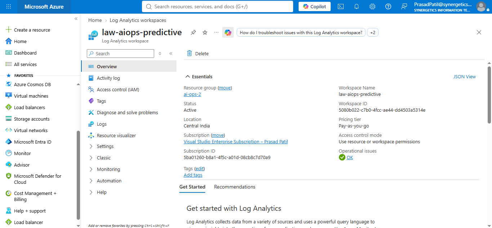
*law-aiops-predictive - Overview*

### 5.2 VM Telemetry Collection (Data Collection Rule)

Virtual machines are handled differently from PaaS resources like Storage or App Service: they do not support the modern Diagnostic Settings blade that those resource types use to stream metrics directly. Instead, guest-level metrics - CPU utilization and network adapter throughput - have to be collected from inside the VM's operating system using the Azure Monitor Agent (AMA).

A Data Collection Rule named `demo-rule` was created to manage this: it defines which performance counters to collect (% Processor Time and network adapter Bytes Total/sec), and which resources the rule applies to. The rule was associated with `test-vm` as shown below, which causes the Azure Monitor Agent to be installed automatically on the VM and begin forwarding the specified counters into the `law-aiops-predictive` workspace.

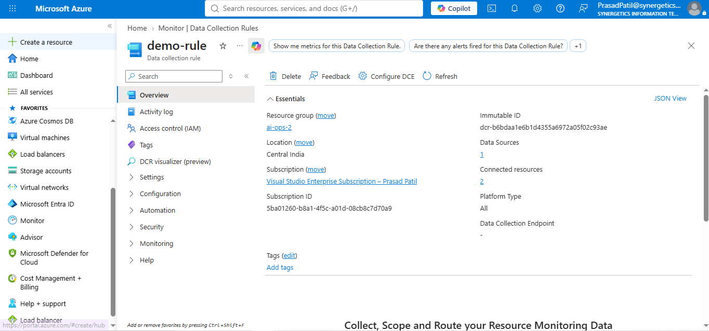
*demo-rule - Data Collection Rule Overview*

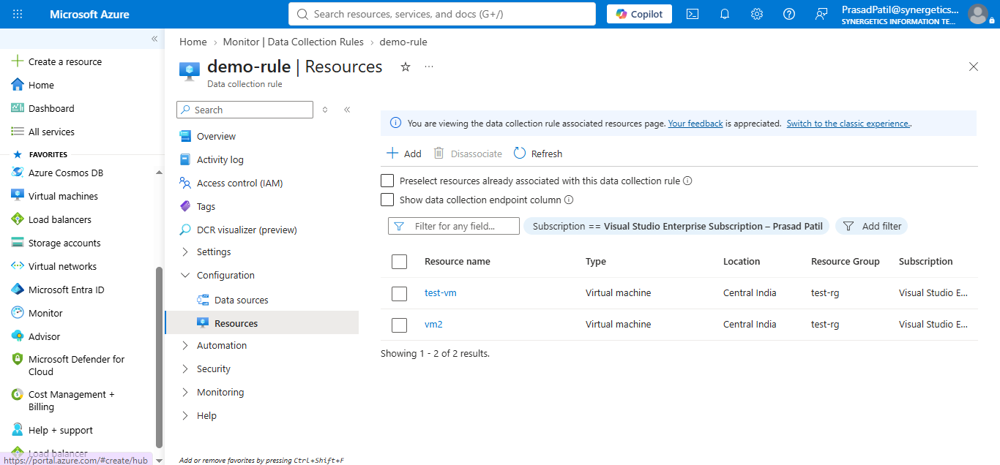
*demo-rule - Associated Resources (test-vm)*

### 5.3 Event Hub

Log Analytics is good for storing and querying telemetry, but it is not designed for real-time streaming - data can take several minutes to land and be queryable. To score telemetry the moment it arrives, this pipeline needs a streaming layer in front of the model, which is the job of Azure Event Hubs.

An Event Hub namespace named `evhns-aiops-predictive` was created (Basic tier, Central India), containing a single event hub called `eh-infra-telemetry` with two partitions. Telemetry from the VM, Storage account, and App Service is all routed into this one event hub, where the Function App described in Section 5.8 picks it up continuously and scores it in near real time.

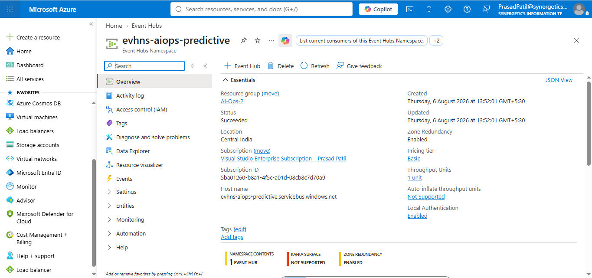
*evhns-aiops-predictive - Namespace Overview*

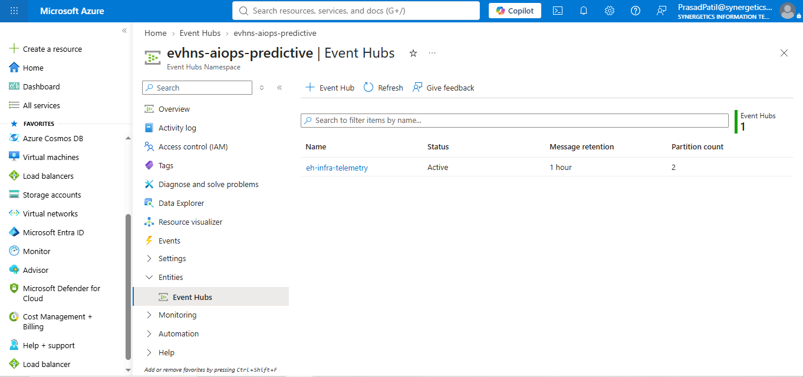
*evhns-aiops-predictive - Event Hubs list*

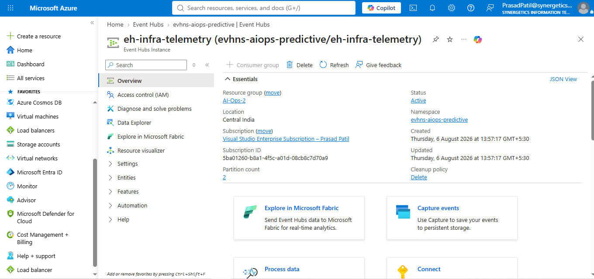
*eh-infra-telemetry - Event Hub Instance Overview*

### 5.4 Diagnostic Settings - Storage Account & App Service

Unlike the VM, Storage accounts and App Services are PaaS resources that support Azure's modern Diagnostic Settings feature directly - metrics can be streamed out of them without installing any agent. A diagnostic setting was added to each of the two resources in scope, exporting their platform metrics to the shared Log Analytics workspace (and from there into the Event Hub streaming pipeline).

On `samplestorage232`, the diagnostic setting streams Transaction metrics - the volume and pattern of read/write operations against the storage account. On `cost-detective-api`, the diagnostic setting streams CpuTime and related App Service platform metrics, capturing how much compute the web app is consuming under real request load.

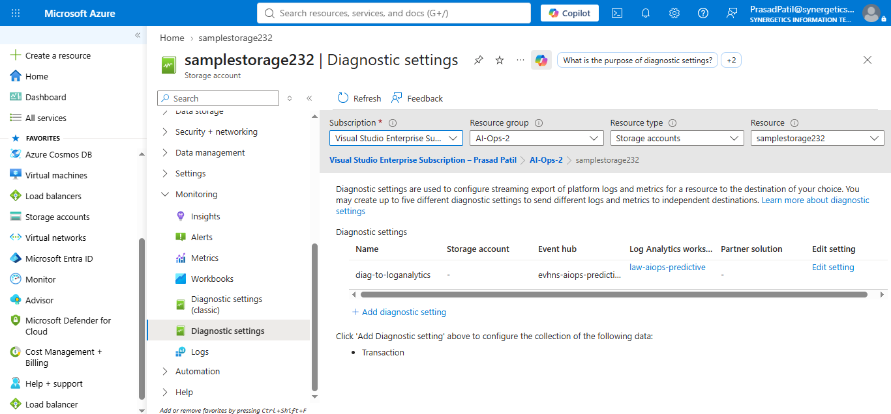
*samplestorage232 - Diagnostic Settings*

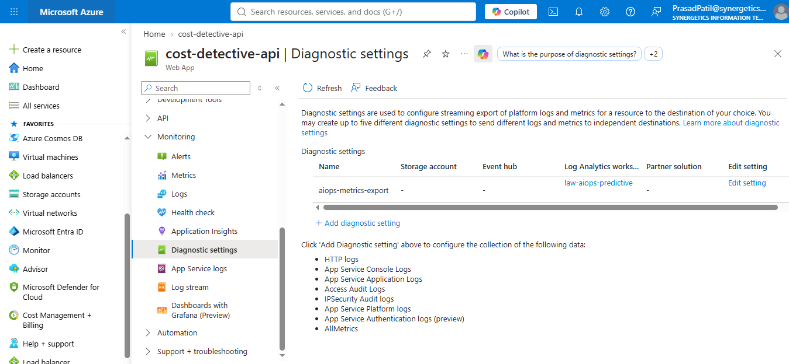
*cost-detective-api - Diagnostic Settings*

### 5.5 Azure Machine Learning Workspace

With telemetry now flowing reliably into Log Analytics, the next step is a place to train, register, and deploy the predictive models themselves. That is the role of the Azure Machine Learning workspace, named `my-workspace`, created in the AI-Ops-2 resource group.

This workspace is linked to `samplestorage232` for storing training data and model artifacts, and it automatically provisioned its own Key Vault (for secrets) and Application Insights instance (for endpoint monitoring) as supporting resources. Every model, training job, and deployed endpoint described in the next two sections lives inside this single workspace.

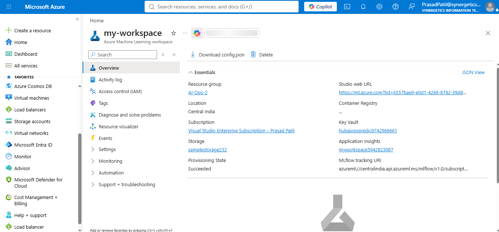
*my-workspace - Azure Machine Learning Workspace Overview*

### 5.6 Model Training (Automated ML)

Rather than hand-coding three separate machine learning models, this POC used Azure's Automated ML (AutoML) capability, which automatically tries a range of algorithms and preprocessing combinations against a training dataset and selects the best-performing one. Three independent AutoML regression jobs were run - one per resource type - because each resource produces a different metric with a different normal range and pattern, and a single blended model would be far less accurate than three specialized ones.

Each job was pointed at a CSV export of historical telemetry for its resource (pulled from Log Analytics), with the metric value set as the prediction target. The App Service and Storage jobs ran to natural completion; the VM job (`training-aiops`) was manually stopped once a sufficient number of trial models had completed, since AutoML continues trying new combinations up to a configurable time budget and a strong candidate model was already available. The three resulting best-performing models - `appjob12`, `storagetrainer09`, and `trainingaiops19` - were then registered in the workspace's model registry.

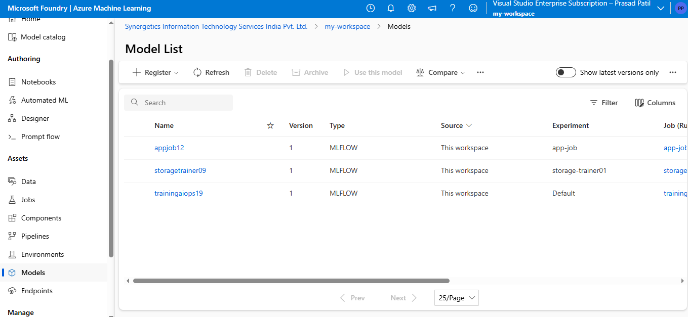
*Model List - appjob12, storagetrainer09, trainingaiops19*

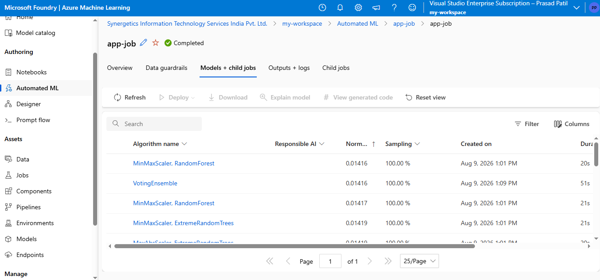
*app-job - Automated ML job (Completed) - App Service model*

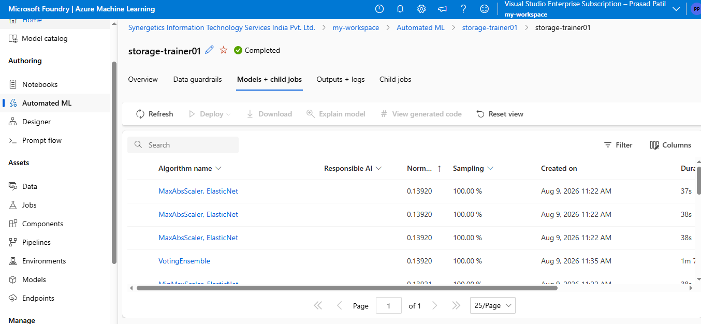
*storage-trainer01 - Automated ML job (Completed) - Storage model*

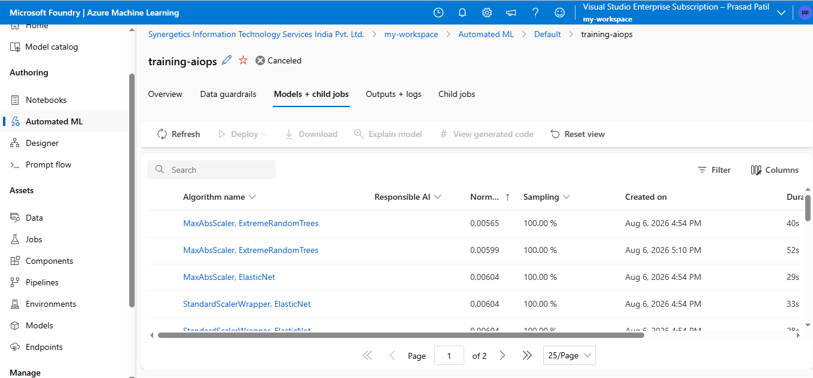
*training-aiops - Automated ML job (Canceled after sufficient trials completed) - VM model*

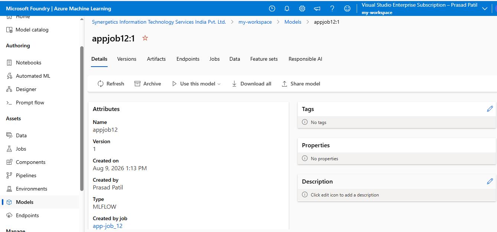
*appjob12:1 - Registered App Service model details*

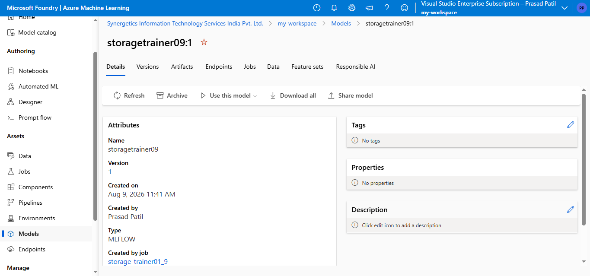
*storagetrainer09:1 - Registered Storage model details*

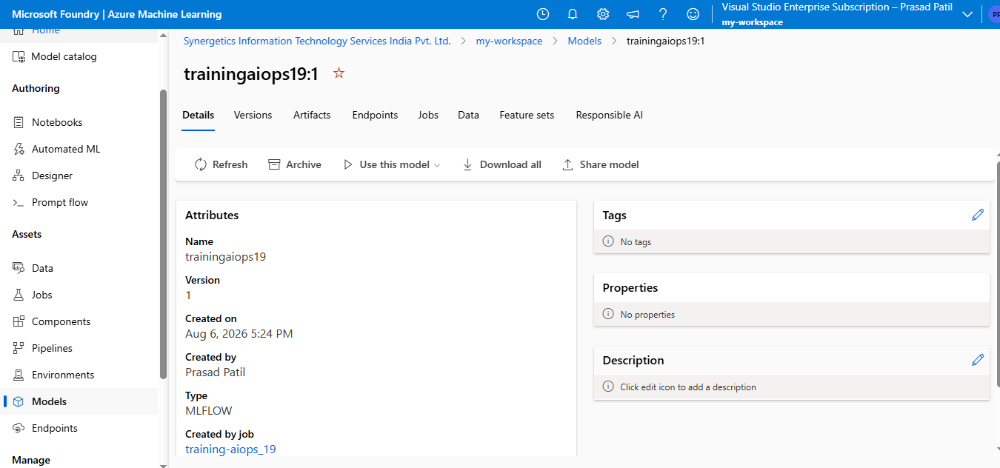
*trainingaiops19:1 - Registered VM model details*

### 5.7 Model Deployment (Real-Time Endpoints)

A trained model sitting in a registry can't score anything on its own - it needs to be deployed behind an endpoint that other services can call over the network. Each of the three registered models was deployed as a managed real-time online endpoint in the ML workspace, which packages the model together with a scoring script (`score.py`) and exposes it as a REST API.

Each endpoint accepts a POST request to a `/score` path containing the input features (timestamp, metric name, and where relevant, instance name) and returns the model's predicted value in response. All three endpoints were verified as Healthy with 100% live traffic routed to their single deployment.

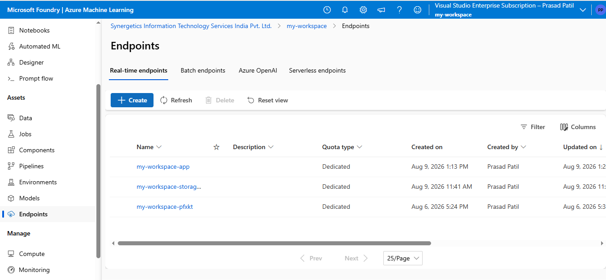
*Endpoints - three real-time endpoints deployed*

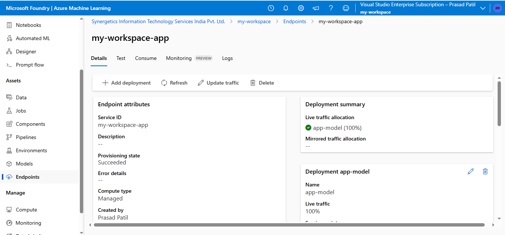
*my-workspace-app - App Service model endpoint (Healthy, 100% traffic)*

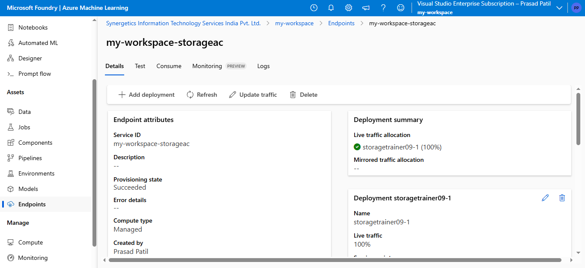
*my-workspace-storageac - Storage model endpoint (Healthy, 100% traffic)*

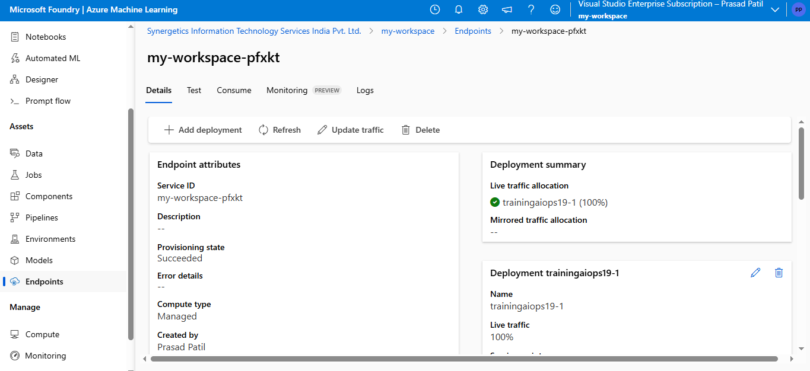
*my-workspace-pfxkt - VM model endpoint (Healthy, 100% traffic)*

### 5.8 Azure Function App - Scoring & Alerting Bridge

With telemetry streaming through Event Hub and three model endpoints ready to score it, something needs to sit in the middle and actually connect the two - reading each incoming event, calling the right model, deciding whether the result is worth an alert, and posting to Teams. That is the role of the Azure Function App `func-aiops-bridge`, containing a single Event Hub-triggered function named `ProcessTelemetry`.

This function is the operational core of the whole system. For every incoming telemetry record, it:

- Routes the record to the correct model endpoint based on resource type (VM performance counter, Storage transaction metric, or App Service CPU metric).
- Computes the percentage deviation between the model's predicted value and the actual observed value.
- Classifies deviations into severity tiers - WARNING, HIGH, or CRITICAL - based on how far the deviation exceeds the alert threshold.
- For VM anomalies: posts an alert to Teams marked as awaiting approval, since VM remediation actions are more disruptive and warrant a human decision first.
- For Storage and App Service: posts an informational alert only - no automated action is taken against these resource types in this POC.
- Applies a 30-minute cooldown per resource, so an ongoing condition doesn't flood the Teams channel with repeat alerts.

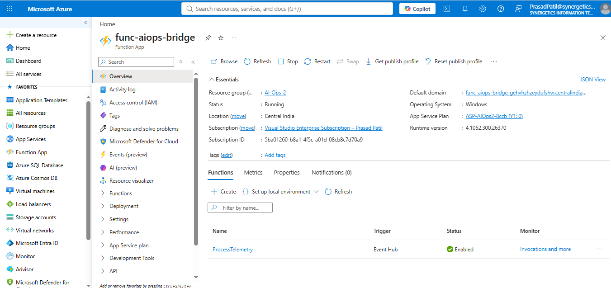
*func-aiops-bridge - Function App Overview*

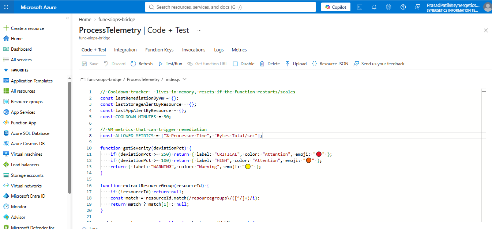
*ProcessTelemetry - Function code (Code + Test)*

### 5.9 Azure Automation Account & Remediation Runbook

Detecting and alerting on a problem is only half of the workflow - the system also needs somewhere to actually run a remediation action once an alert has been approved. That is provided by an Azure Automation Account named `aiops-ac`, created in the AI-Ops-2 resource group.

Inside this account, a runbook named `test-runbook` was authored in PowerShell and published, making it callable by the Function App once a VM alert is approved.

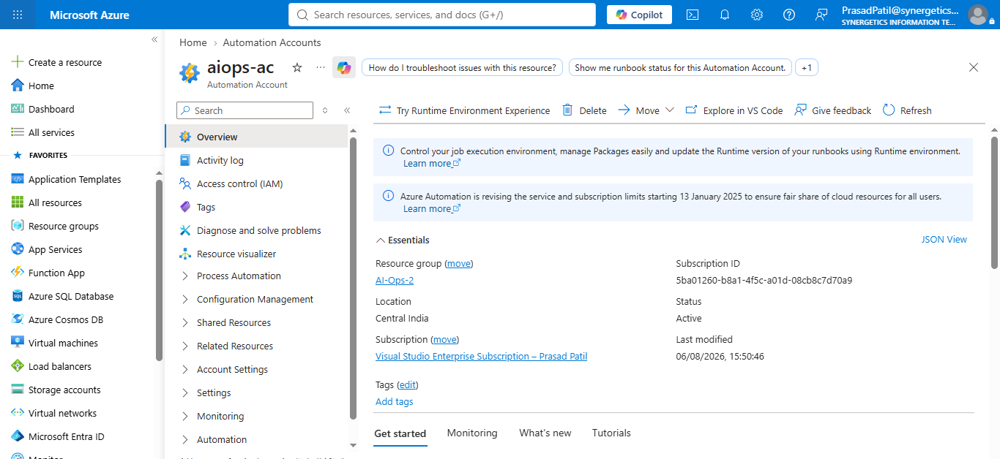
*aiops-ac - Automation Account Overview*

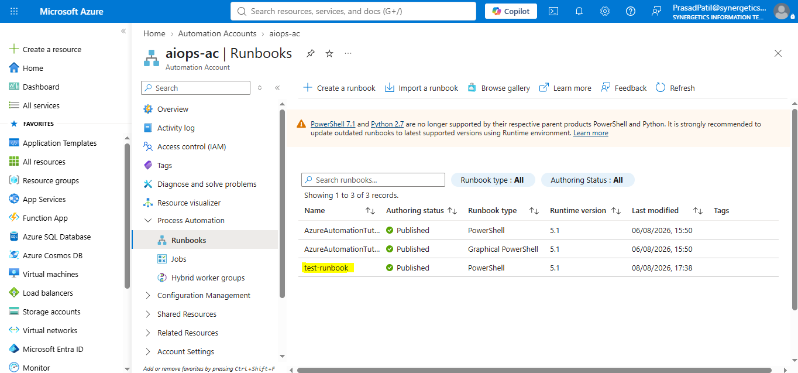
*aiops-ac - Runbooks (test-runbook, Published)*

### 5.10 Microsoft Teams Integration

Rather than building a separate web dashboard for alerts and approvals, this POC deliberately uses Microsoft Teams as the operator interface. A dedicated team (`aiops-pred`) and channel (`aiops-pred1`) were set up specifically for this monitoring workflow.

Three separate Workflow connectors were configured in this channel:

- **App Alert Webhook** - informational alerts for the App Service model.
- **Storage Alert Webhook** - informational alerts for the Storage model.
- **Remediation Status Webhook** - VM anomaly alerts requiring approval, plus remediation status updates.

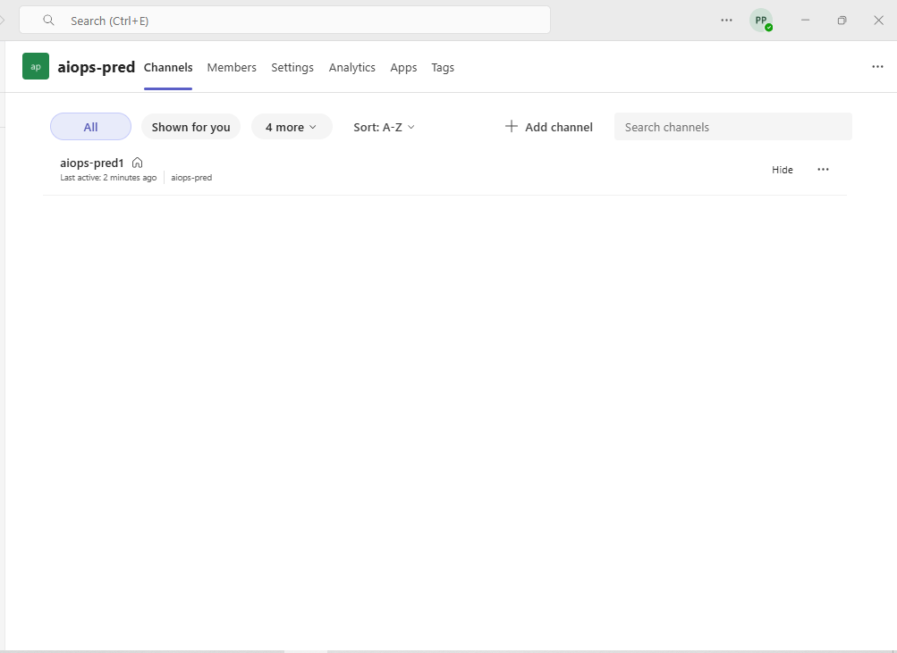
*aiops-pred - Teams channel (aiops-pred1)*

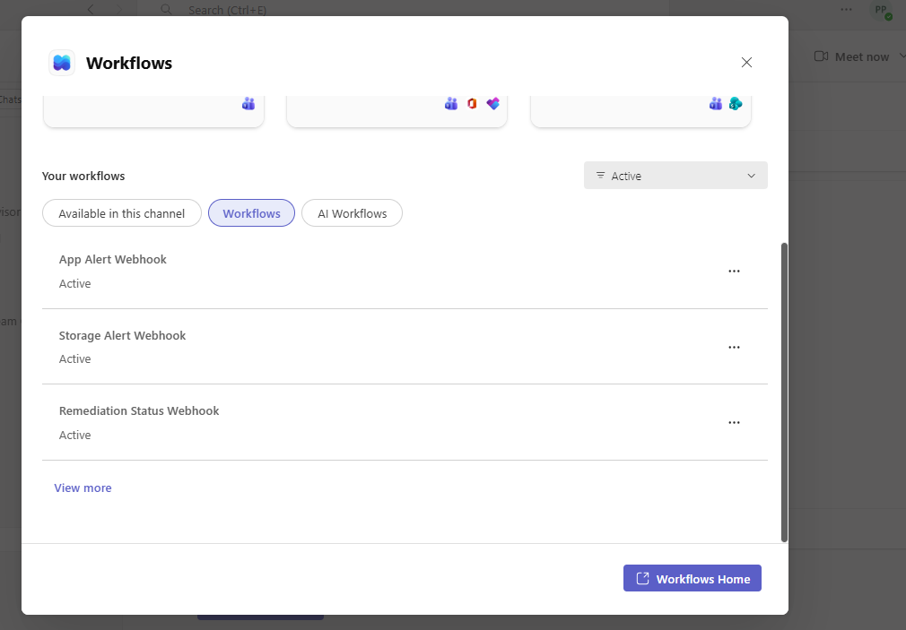
*Configured Workflows - App Alert, Storage Alert, and Remediation Status webhooks*

### 5.11 End-to-End Validation

The final step was to validate the system against live, real production telemetry. The example below shows the Storage model scoring a genuine transaction event from `samplestorage232`, correctly recognizing that the actual value (5) was close to its prediction (~4.68, a 7% deviation), and classifying the result as NORMAL.

Because the deviation was small and within tolerance, no anomaly alert was raised - instead the system posted an informational confirmation card to Teams, demonstrating that the pipeline correctly distinguishes ordinary, healthy behavior from a genuine problem.

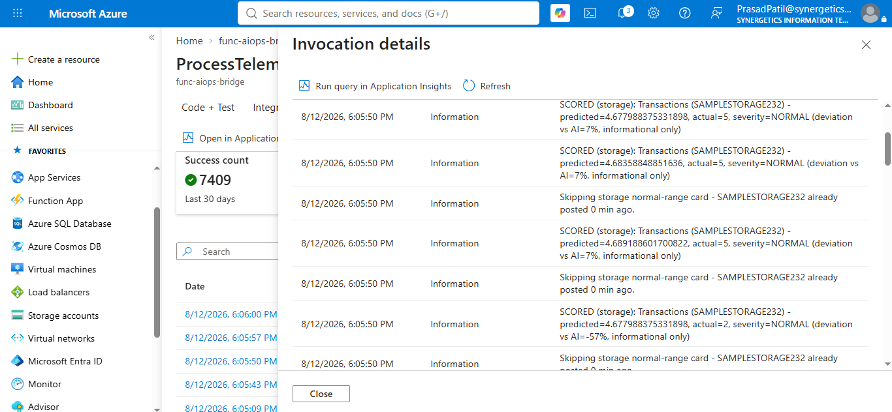
*Function App Invocation log - real SCORED events, correctly classified as NORMAL*

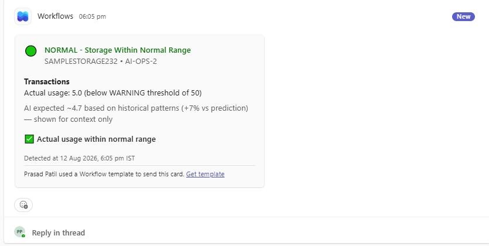
*Corresponding Teams card - "Storage Within Normal Range"*

## 6. Model Accuracy Summary

All four models were evaluated under normal operating conditions against real production events captured directly from Application Insights and Log Analytics - not synthetic or hand-picked data.

| Model | Events Analyzed | Avg. Deviation |
|---|---|---|
| App Service - cost-detective-api | 1,136 | 6.1% (median 4.0%) |
| Storage Account - samplestorage232 | 8,324 | 13.9% (median 8.6%) |
| Virtual Machine - CPU (test-vm) | 65 | 14.7% (median 9.2%) |
| Network - VM Adapters (test-vm) | 168 | 18.6% (median 11.2%) |

*"Deviation" is the percentage difference between the model's predicted value and the actual observed value for the same metric at the same time - lower means the model's prediction was closer to what really happened.*

- The App Service model shows tight, consistent tracking of real CPU usage.
- The Storage, VM Compute, and Network models track their respective metrics with strong overall accuracy.
- All models are suitable for continued use in the current monitoring and alerting workflow.

